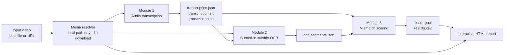
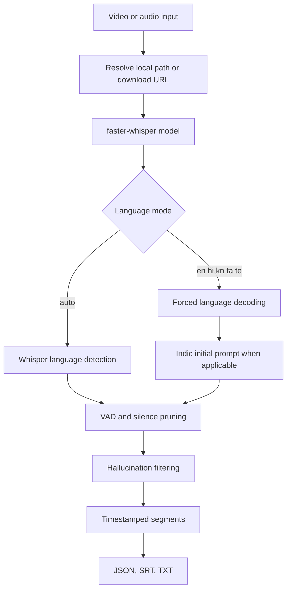
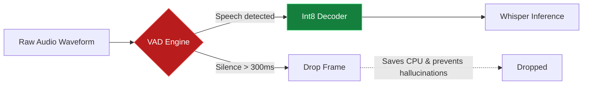
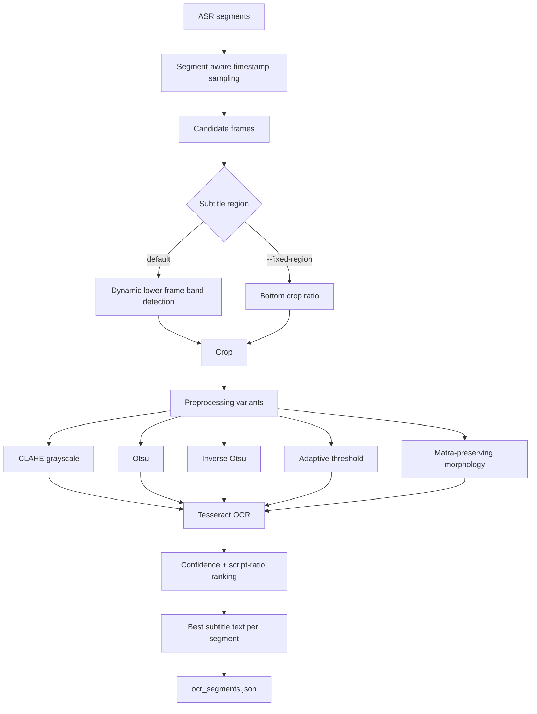
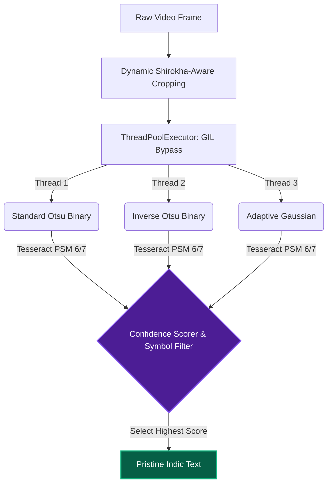
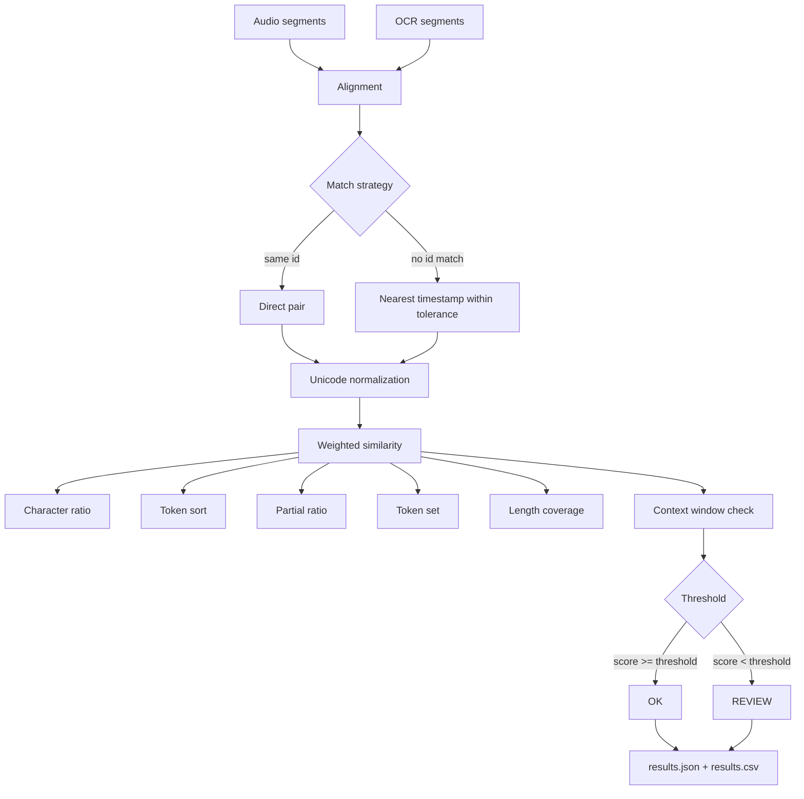
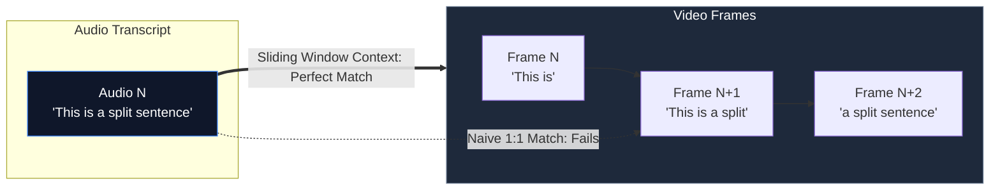
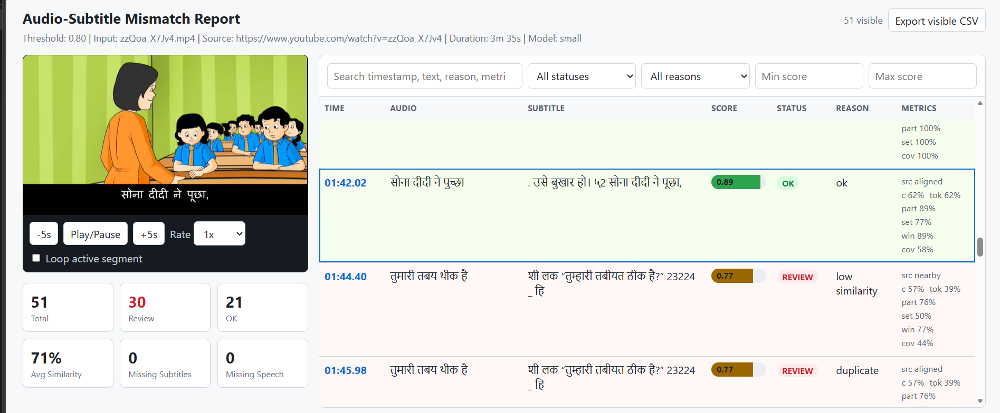
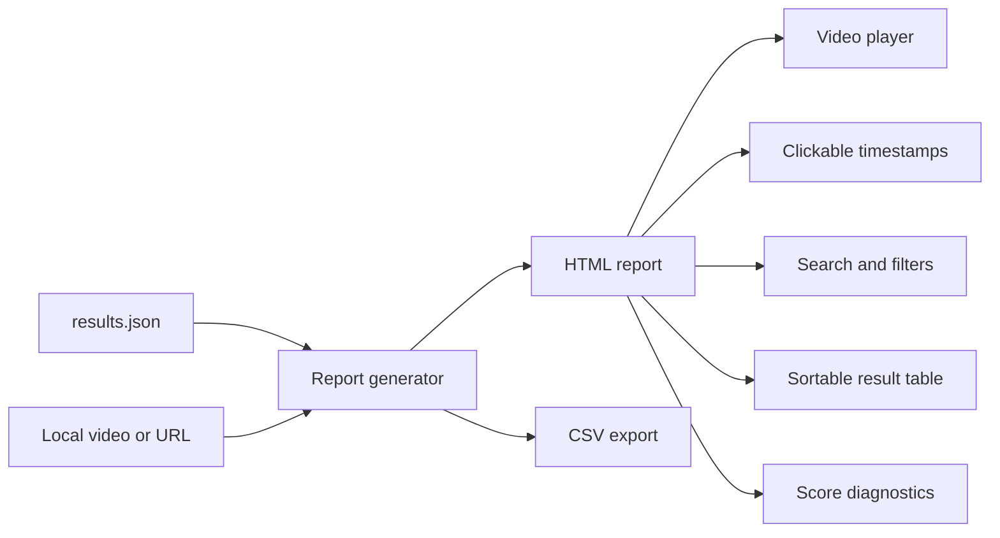

# Burn-in Subtitle Checker

Production-shaped Python CLI for finding likely mismatches between spoken dialogue and burned-in subtitles in local or online video.

The tool is built for media QA workflows: transcribe the audio, OCR the on-screen subtitles, compare both streams with timestamp-aware scoring, and generate an interactive review report so humans inspect only the moments that need attention.

It does not rely on hardcoded examples or demo-only fixtures. The pipeline accepts real media, keeps every module independently runnable, and writes structured artifacts that can be inspected, reused, and tested.

.png)

## Uniqueness

Most simple burn-in subtitle demos fail for the same reasons: ASR is slow or unstable on Indic languages, OCR breaks on real backgrounds, and naive one-to-one matching over-flags timing drift. This implementation addresses those failure modes directly.

| Area | What this project does |
|---|---|
| Multilingual support | First-class CLI support for English, Hindi, Kannada, Tamil, and Telugu |
| ASR reliability | Uses `faster-whisper`, deterministic temperature `0.0`, language forcing, Indic script prompts, VAD, and hallucination filtering |
| OCR robustness | Uses dynamic subtitle-region detection, segment-aware frame sampling, multiple preprocessing variants, Tesseract confidence ranking, and OCR effort presets |
| Alignment quality | Matches by id when available, falls back to timestamp tolerance, then checks nearby subtitles for drift and split lines |
| Reviewer workflow | Generates standalone HTML with a video player, clickable timestamps, search, filters, sorting, score diagnostics, segment looping, and CSV export |
| Runtime efficiency | Supports int8 ASR, beam-size control, OCR effort presets, resumable runs, and explicit reuse of ASR/OCR outputs |
| Auditability | Writes JSON, SRT, TXT, CSV, HTML, and a run manifest for reproducible review |

## Supported Languages

| Language | ASR code | Tesseract code | Notes |
|---|---:|---:|---|
| English | `en` | `eng` | Fastest and generally strongest ASR/OCR baseline |
| Hindi | `hi` | `hin` | Uses Devanagari prompt anchoring and Unicode normalization |
| Kannada | `kn` | `kan` | Uses Kannada script filtering and OCR pack mapping |
| Tamil | `ta` | `tam` | Supported through ASR forcing and Tamil OCR pack mapping |
| Telugu | `te` | `tel` | Supported through ASR forcing and Telugu OCR pack mapping |

`multi` OCR mode uses all five packs together: `eng+hin+kan+tam+tel`.

## Architecture



## Module 1: Audio Transcription

Module 1 converts audio/video into timestamped speech segments with deterministic ASR settings suitable for QA.



### VAD Pruning Execution

To guarantee high-speed CPU inference and ~zero hallucinated text, the pipeline explicitly drops dead audio before it reaches the decoder.



Key ASR decisions:

- `temperature=0.0` by default for deterministic, repeatable QA output.
- `faster-whisper` with `int8` compute by default for practical CPU use.
- `beam_size=2` by default to reduce latency, configurable for harder audio.
- VAD removes short silence before decoding, reducing wasted compute and common silence hallucinations.
- Indic prompts nudge Whisper toward the correct script for Hindi, Kannada, Tamil, and Telugu.

## Module 2: Subtitle OCR

Module 2 reads transcription timestamps, samples video frames, finds likely subtitle regions, and runs OCR with language-aware filtering.



### Tri-Variant OCR Execution

A simple Otsu threshold fails on half-dark/half-light video backgrounds. Module 2 bypasses Python's Global Interpreter Lock (GIL) to run three distinct algorithmic variants simultaneously.



OCR effort presets control speed and recall:

| Effort | Behavior | Best use |
|---|---|---|
| `fast` | Fewer preprocessing variants and PSM passes | Quick triage, clean videos |
| `balanced` | Default tradeoff across variants and PSM modes | Most review runs |
| `accurate` | Wider OCR search | Difficult fonts, compression, busy backgrounds |

## Module 3: Mismatch Scoring

Module 3 compares ASR text with OCR text, preserving audit details for each score.



### Sliding-Window Context Heuristic

Naive 1-to-1 string matching fails when editors split a spoken sentence across two different visual subtitle frames (temporal drift). The Sliding-Window heuristic evaluates adjacent frames mathematically to neutralize these false positives.



The scoring output records:

- final score
- status: `OK` or `REVIEW`
- reason: `ok`, `low_similarity`, `missing_subtitle`, `missing_speech`, or `duplicate`
- score components: character, token sort, partial, token set, and length coverage
- match source: aligned segment, nearby segment, or nearby pair

## Interactive Report

The report is a standalone HTML review surface, not just a static table.





Report features:

- linked local or online video
- timestamp buttons that seek the video to the exact review point
- playback speed controls
- quick `-5s` and `+5s` seeking
- segment loop option for repeated manual inspection
- search across timestamp, text, status, reason, and metrics
- filter by status, reason, and score range
- sortable columns
- visible-row CSV export from the browser
- generated `results.csv` from Python

.png)


## Installation

Use Python 3.10 or newer.

```powershell
python -m venv .venv
.venv\Scripts\activate
python -m pip install --upgrade pip
python -m pip install -e .
python -m pip install -r requirements.txt
```

Install system dependencies:

- FFmpeg, or the `imageio-ffmpeg` Python fallback for many operations
- Tesseract OCR
- Tesseract language packs: `eng`, `hin`, `kan`, `tam`, `tel`

Check OCR language packs:

```powershell
tesseract --list-langs
```

Expected language list should include:

```text
eng
hin
kan
tam
tel
```

## End-to-End Usage

Local Hindi video:

```powershell
subtitle-checker run video.mp4 --language hi --ocr-language hi --model medium --ocr-effort balanced --output-dir outputs/hindi_review
```

Kannada video with assets copied beside the report:

```powershell
subtitle-checker run video.mp4 --language kn --ocr-language kn --model medium --asset-mode copy --output-dir outputs/kannada_review
```

Local video with a browser-safe MP4 preview for the report player:

```powershell
subtitle-checker run video.mkv --language hi --ocr-language hi --model medium --asset-mode preview --output-dir outputs/hindi_review
```

Tamil YouTube video:

```powershell
subtitle-checker run "https://www.youtube.com/watch?v=VIDEO_ID" --language ta --ocr-language ta --cookies-from-browser chrome --output-dir outputs/tamil_review
```

YouTube with a Netscape `cookies.txt` file:

```powershell
subtitle-checker run "https://www.youtube.com/watch?v=VIDEO_ID" --language hi --ocr-language hi --cookies cookies.txt --output-dir outputs/youtube_cookie_file
```

YouTube with browser profile, user-agent, and request delay:

```powershell
subtitle-checker run "https://www.youtube.com/watch?v=VIDEO_ID" --language hi --ocr-language hi --cookies-from-browser "firefox:default-release" --user-agent "Mozilla/5.0 ..." --sleep-requests 5 --output-dir outputs/youtube_browser_profile
```

Telugu high-recall OCR run:

```powershell
subtitle-checker run video.mp4 --language te --ocr-language te --model medium --ocr-effort accurate --samples-per-segment 5 --output-dir outputs/telugu_review
```

The run command writes:

```text
outputs/.../
  transcription/
    transcription.json
    transcription.srt
    transcription.txt
  ocr/
    ocr_segments.json
  report/
    results.json
    results.csv
    report.html
  run_manifest.json
```

## Independent Module Usage

Transcription only:

```powershell
subtitle-checker transcribe video.mp4 --language hi --model medium --temperature 0.0 --output-dir outputs/transcription
```

OCR only:

```powershell
subtitle-checker ocr video.mp4 outputs/transcription/transcription.json --language hi --ocr-effort balanced --output outputs/ocr/ocr_segments.json
```

Compare ASR and OCR:

```powershell
subtitle-checker compare outputs/transcription/transcription.json outputs/ocr/ocr_segments.json --video video.mp4 --threshold 0.80 --output-json outputs/report/results.json --output-html outputs/report/report.html --output-csv outputs/report/results.csv
```

Generate report only from existing results:

```powershell
subtitle-checker report outputs/report/results.json --video video.mp4 --output-html outputs/report/review.html --output-csv outputs/report/review.csv
```

## Batch Processing

Every CLI layer can work on a directory when the input path is a folder. The pipeline creates one isolated artifact folder per media file so failures and retries do not overwrite other videos.

Full pipeline for a folder:

```powershell
subtitle-checker run inputs/videos --language hi --ocr-language hi --model medium --ocr-effort balanced --recursive --continue-on-error --output-dir outputs/batch_review
```

Transcription-only batch:

```powershell
subtitle-checker transcribe inputs/videos --language auto --model medium --recursive --output-dir outputs/batch_transcription
```

OCR-only batch using matching transcription folders:

```powershell
subtitle-checker ocr inputs/videos outputs/batch_transcription --language multi --recursive --output outputs/batch_ocr/ocr_segments.json
```

Comparison/report batch using matching JSON folders:

```powershell
subtitle-checker compare outputs/batch_transcription outputs/batch_ocr --video inputs/videos --output-json outputs/batch_compare/results.json --output-html outputs/batch_compare/report.html --output-csv outputs/batch_compare/results.csv
```

Report-only batch from existing `results.json` files:

```powershell
subtitle-checker report outputs/batch_compare --video inputs/videos --asset-mode preview --output-html outputs/batch_reports/report.html --output-csv outputs/batch_reports/results.csv
```

By default, folder mode scans common audio/video extensions across MP4, MKV, MOV, AVI, WebM, MPEG, TS, WMV, FLV, MP3, WAV, FLAC, AAC, Opus, Ogg, and related containers. Add `--include-all-files` only when a source uses uncommon extensions and you want ffmpeg/OpenCV to decide whether each file is usable.

## Resumable and Reusable Runs

Long videos should not require re-running expensive ASR/OCR after every report or threshold tweak.

Reuse matching artifacts in the same output folder:

```powershell
subtitle-checker run video.mp4 --language hi --ocr-language hi --resume --output-dir outputs/hindi_review
```

Reuse a specific transcription:

```powershell
subtitle-checker run video.mp4 --language hi --ocr-language hi --reuse-transcription outputs/transcription/transcription.json --output-dir outputs/review_from_asr
```

Reuse a specific OCR output:

```powershell
subtitle-checker run video.mp4 --language hi --ocr-language hi --reuse-ocr outputs/ocr/ocr_segments.json --output-dir outputs/review_from_ocr
```

## Speed and Accuracy Controls

| Option | Default | Use when |
|---|---:|---|
| `--model` | `medium` for Indic, `small` for English/auto | Increase to `large-v3` for harder audio; lower to `small` for speed |
| `--compute-type` | `int8` | Use `float16` or `int8_float16` on CUDA |
| `--beam-size` | `2` | Increase for difficult audio; lower for speed |
| `--temperature` | `0.0` | Keep deterministic for QA; raise only for controlled experiments |
| `--no-vad` | off | Disable only if VAD removes valid speech |
| `--crop-ratio` | `0.15` | Increase for larger subtitle bands or lower-third captions |
| `--window-seconds` | `0.35` | Increase when subtitles lead or lag speech |
| `--samples-per-segment` | `3` | Increase for difficult timing; lower for speed |
| `--ocr-effort` | `balanced` | Use `fast` for quick triage, `accurate` for difficult OCR |
| `--fixed-region` | off | Use when dynamic band detection selects the wrong region |
| `--threshold` | `0.80` | Raise for stricter review, lower to reduce false positives |
| `--context-window-seconds` | `2.0` | Increase for larger subtitle timing drift |
| `--asset-mode` | `link` | Use `copy` to package local video beside report; use `preview` to generate browser-safe MP4 playback |
| `--resume` | off | Reuse matching ASR/OCR artifacts |
| `--reuse-transcription` | unset | Skip ASR with a specific transcription JSON |
| `--reuse-ocr` | unset | Skip OCR with a specific OCR JSON |
| `--cookies-from-browser` | unset | Let yt-dlp read a browser session, e.g. `chrome`, `edge`, `firefox:Profile` |
| `--cookies` | unset | Use a Mozilla/Netscape `cookies.txt` file |
| `--user-agent` | unset | Match the browser user-agent used with cookies |
| `--referer` | unset | Pass a referer header to yt-dlp |
| `--add-header` | repeatable | Pass extra HTTP headers, e.g. `Accept-Language: en-US,en;q=0.9` |
| `--extractor-args` | repeatable | Forward raw yt-dlp extractor args, e.g. `youtube:player_client=mweb` |
| `--proxy` | unset | Route yt-dlp through a proxy |
| `--source-address` | unset | Use the same local IP used when solving a browser challenge |
| `--sleep-requests` | unset | Add delay between yt-dlp requests to reduce rate-limit pressure |
| `--retries` | `3` | yt-dlp retry count |
| `--ytdlp-format` | `bv*+ba/bestvideo+bestaudio/best/b` | Override the yt-dlp format selector |
| `--format-sort` | repeatable | Prefer formats, e.g. `res:720` or `codec:h264` |
| `--js-runtimes` | repeatable | Enable yt-dlp JavaScript runtimes such as `deno` or `node` |
| `--remote-components` | repeatable | Allow yt-dlp EJS components such as `ejs:npm` or `ejs:github` |
| `--list-formats` | off | Print available yt-dlp formats and exit before pipeline work |
| `--recursive` | off | Batch mode: scan nested folders |
| `--include-all-files` | off | Batch mode: send every file to the media backend |
| `--continue-on-error` | off | Batch mode: keep processing after one file fails |

Recommended starting points:

| Scenario | Suggested command choices |
|---|---|
| Fast English review | `--language en --ocr-language en --model small --ocr-effort fast` |
| Standard Indic review | `--language hi|kn|ta|te --model medium --ocr-effort balanced` |
| Difficult compressed video | `--model medium --ocr-effort accurate --samples-per-segment 5 --window-seconds 0.6` |
| Re-running after tuning threshold | Use `subtitle-checker compare` or `subtitle-checker report` instead of re-running ASR/OCR |

## YouTube and Cookie Handling

The CLI exposes the main yt-dlp authentication and request-shaping options needed for real YouTube review work.

Browser cookies:

```powershell
subtitle-checker run "https://www.youtube.com/watch?v=VIDEO_ID" --language hi --ocr-language hi --cookies-from-browser chrome
```

Browser profile:

```powershell
subtitle-checker run "https://www.youtube.com/watch?v=VIDEO_ID" --language hi --ocr-language hi --cookies-from-browser "firefox:default-release"
```

Netscape cookie file:

```powershell
subtitle-checker run "https://www.youtube.com/watch?v=VIDEO_ID" --language hi --ocr-language hi --cookies cookies.txt
```

The `cookies.txt` file must be Mozilla/Netscape format and start with either:

```text
# HTTP Cookie File
```

or:

```text
# Netscape HTTP Cookie File
```

Advanced request options:

```powershell
subtitle-checker run "https://www.youtube.com/watch?v=VIDEO_ID" `
  --language hi `
  --ocr-language hi `
  --cookies cookies.txt `
  --user-agent "Mozilla/5.0 ..." `
  --referer "https://www.youtube.com/" `
  --add-header "Accept-Language: en-US,en;q=0.9" `
  --extractor-args "youtube:player_client=mweb" `
  --sleep-requests 5 `
  --retries 5
```

When yt-dlp reports `n challenge solving failed`, install/update the official EJS support and enable a JavaScript runtime:

```powershell
python -m pip install -U "yt-dlp[default]"

subtitle-checker run "https://www.youtube.com/watch?v=VIDEO_ID" `
  --language hi `
  --ocr-language hi `
  --cookies cookies.txt `
  --js-runtimes node `
  --remote-components ejs:github `
  --list-formats
```

Use `--js-runtimes deno --remote-components ejs:npm` if Deno is your installed runtime. The important check is that `--list-formats` must show real video/audio rows such as `mp4`, `m4a`, or `webm`; storyboard-only output cannot feed the pipeline.

If `--list-formats` shows only images/storyboards and no video/audio formats, YouTube has not exposed a playable stream to yt-dlp in the current cookie/session/runtime context. Refresh cookies from a browser session that can play the video, update yt-dlp, and retry with the same network/user-agent context before running ASR/OCR.

Important practical notes:

- Fresh browser cookies are often more reliable than stale exported cookies.
- If YouTube presents a bot/CAPTCHA challenge, solve it in the browser and use cookies from the same account/session and network context.
- Some YouTube formats and restrictions may require newer yt-dlp behavior such as PO-token related extractor args. The CLI forwards raw `--extractor-args`, `--js-runtimes`, and `--remote-components` so those settings can be supplied without code changes.
- There is no permanent or guaranteed "bypass" for YouTube restrictions. The project exposes yt-dlp's supported authentication hooks and fails with actionable guidance when YouTube still blocks access.

## Output Contracts

`transcription.json`:

```json
{
  "metadata": {
    "model": "medium",
    "language_requested": "hi",
    "temperature": 0.0,
    "segment_count": 10
  },
  "segments": [
    {"id": 1, "start": 0.0, "end": 2.4, "midpoint": 1.2, "text": "..."}
  ]
}
```

`ocr_segments.json`:

```json
{
  "metadata": {
    "language": "hi",
    "tesseract_language": "hin",
    "ocr_effort": "balanced"
  },
  "segments": [
    {
      "id": 1,
      "timestamp": 1.2,
      "subtitle_text": "...",
      "confidence": 0.82,
      "status": "ok",
      "crop_region": {"x": 0, "y": 612, "width": 1280, "height": 108},
      "ocr_variant": "otsu/psm6"
    }
  ]
}
```

`results.json`:

```json
{
  "metadata": {
    "threshold": 0.8,
    "segment_count": 10,
    "flagged_count": 2
  },
  "segments": [
    {
      "timestamp": 12.5,
      "audio_text": "...",
      "subtitle_text": "...",
      "score": 0.61,
      "status": "REVIEW",
      "reason": "low_similarity",
      "metrics": {
        "char": 0.62,
        "token_sort": 0.58,
        "partial": 0.74,
        "token_set": 0.60,
        "length_coverage": 0.88,
        "match_source": "aligned"
      }
    }
  ]
}
```

## Testing

```powershell
python -m pytest
python -m compileall -q src tests
```

The unit tests are designed to run without downloading Whisper models and without requiring Tesseract language packs. Real ASR/OCR validation is intentionally kept as a local integration/demo step because model downloads and OCR packs are machine-dependent.

## Known Limitations

- ASR and OCR are probabilistic model-backed steps. The tool flags likely issues for human review; it should not be presented as a replacement for editorial judgment.
- OCR quality depends on resolution, compression, subtitle styling, contrast, motion blur, and installed Tesseract language data.
- Larger Whisper models improve many Indic-language cases but increase runtime.
- Code-switched speech and stylized subtitles remain challenging.
- A future production deployment should add a curated real-video regression set for all supported languages and optionally compare Tesseract with another OCR backend.

## Project Fit

This implementation directly maps to the requested DMP 2026 pipeline:

- Module 1: Whisper-based timestamped transcription
- Module 2: frame capture plus OCR with Indic language support
- Module 3: mismatch detection plus human-readable HTML report

It also adds the pieces that make the prototype more useful in real review sessions: deterministic output, resumability, multilingual support beyond the minimum, reviewer-centric report UX, and structured artifacts for debugging and future evaluation.
